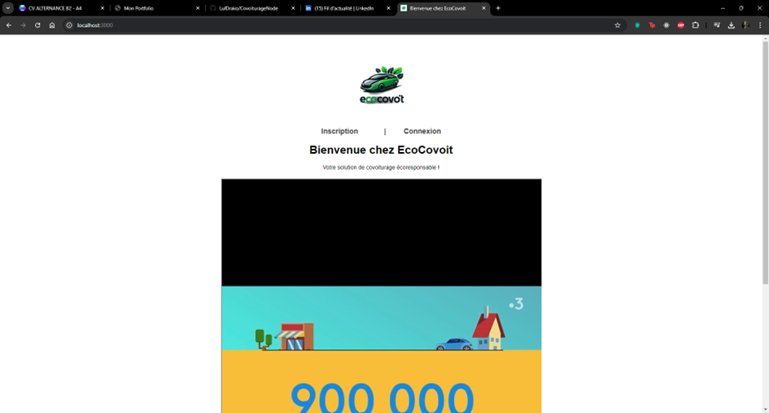
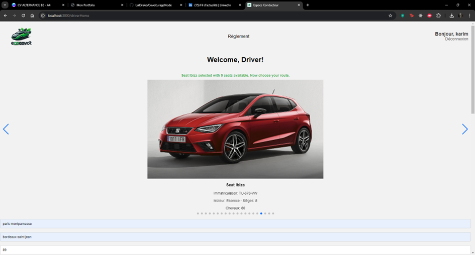
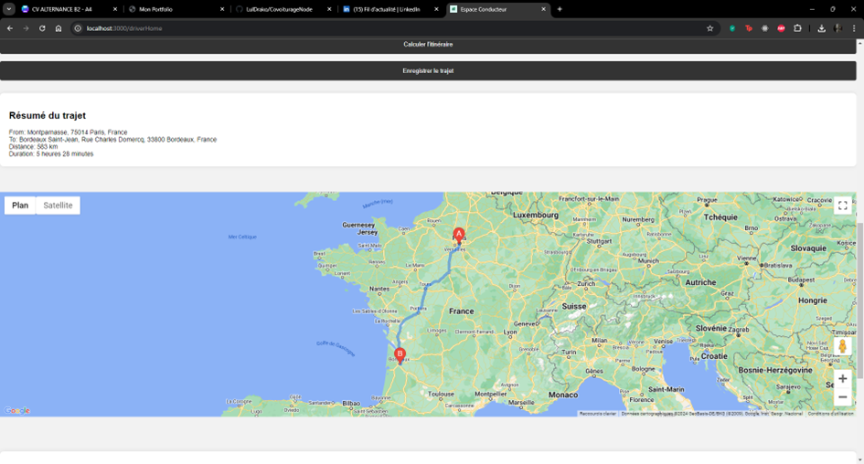
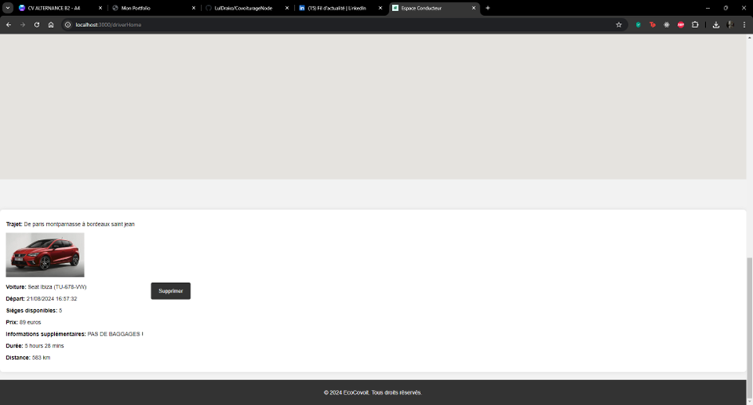
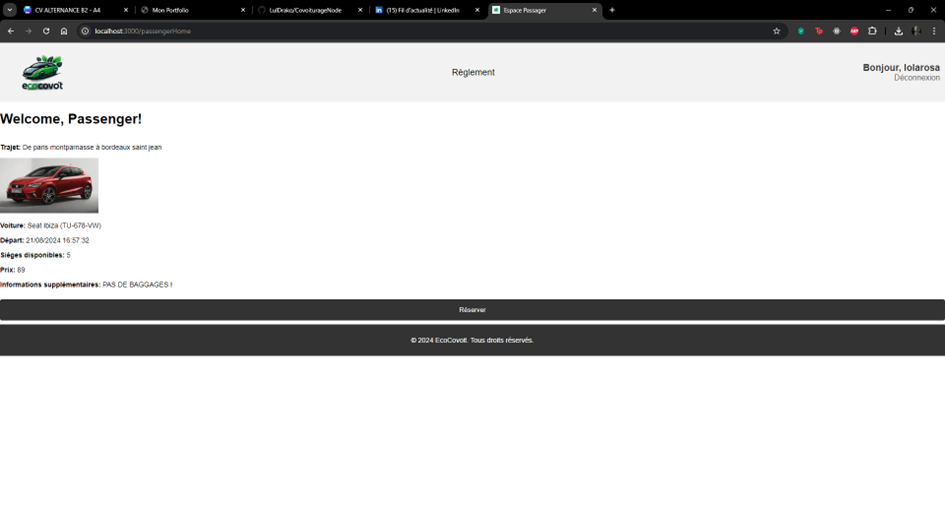
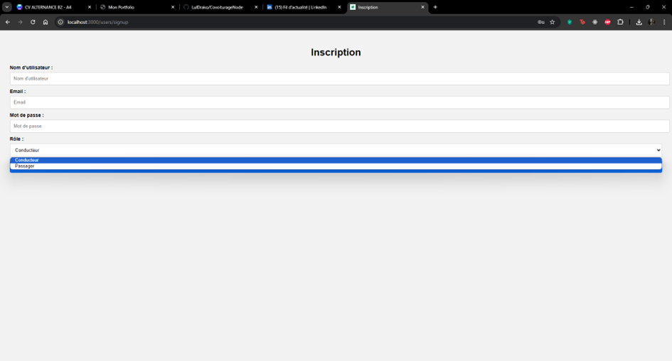
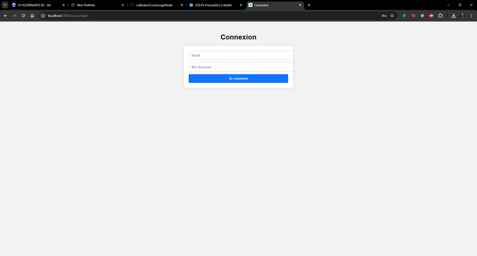
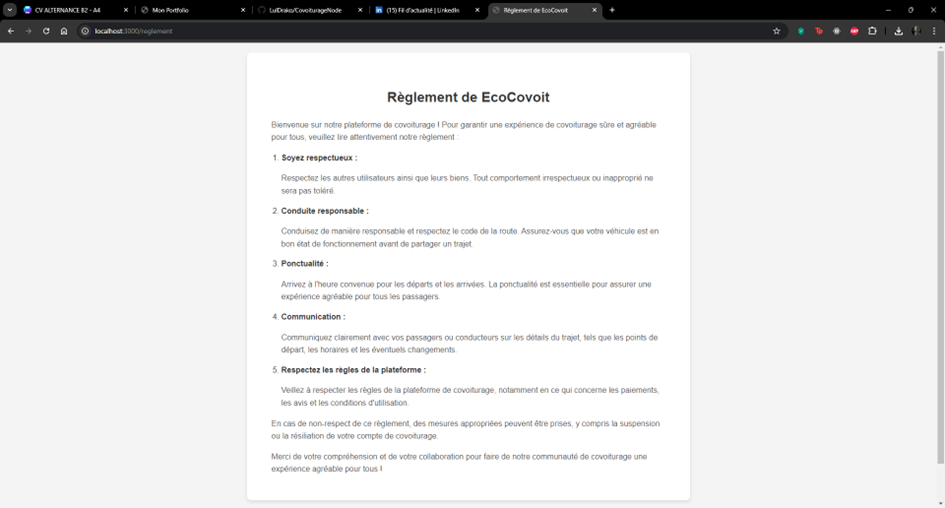

# EcoCovoit

**Statut** : En développement

## Description

EcoCovoit est une plateforme de covoiturage qui permet aux utilisateurs de partager des trajets facilement. Elle connecte conducteurs et passagers, leur permettant d'organiser des trajets ensemble, tout en simplifiant la gestion des réservations et la communication entre les utilisateurs.

Le projet utilise :
- **Node.js** pour le backend,
- **EJS** pour le front-end dynamique côté serveur,
- **MongoDB** pour la gestion des données.

## Fonctionnalités

- Création et gestion de trajets par les conducteurs.
- Recherche de trajets par les passagers.
- Authentification sécurisée des utilisateurs.
- Système de réservation de covoiturage intégré.
- Interface utilisateur simple et intuitive.

## Technologies

- **Node.js** : Développement côté serveur
- **EJS** : Rendu dynamique des pages HTML
- **MongoDB** : Stockage et gestion des données
- **Express** : Gestion des routes HTTP
- **CSS/HTML** : Stylisation de l'interface utilisateur

## Screenshots

Voici quelques captures d'écran du projet pour illustrer l'interface utilisateur :

















## Installation

1. Clonez ce dépôt :
   ```bash
   git clone https://github.com/LulDrako/CovoiturageNode.git
   ```
2. Installez les dépendances :
   ```bash
   npm install
   ```
3. Créez un fichier `.env` pour la configuration des variables d'environnement (comme la connexion à MongoDB). Exemple de contenu :
   ```bash
   DB_CONNECTION_STRING=your_mongodb_connection_string
   API_KEY=your_api_key
   ```
4. Démarrez le serveur :
   ```bash
   node app.js
   ```

## Fonctionnalités futures

- Intégration de notifications en temps réel pour les utilisateurs.
- Système de notation pour les conducteurs et passagers.
- Ajout de cartes interactives pour visualiser les trajets.

## Contribuer

Les contributions sont les bienvenues ! Vous pouvez soumettre des issues ou des pull requests.